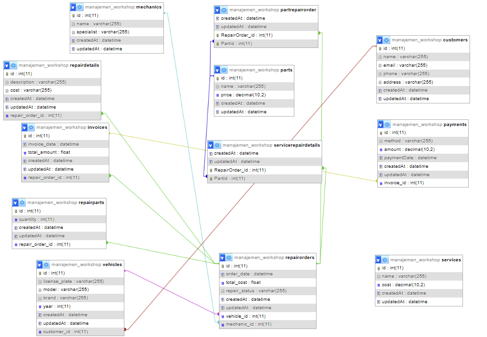

# CASE PROJECT: Sistem Manajemen Bengkel 🚗🔧

Deskripsi: Sistem ini membantu mengelola operasional bengkel, termasuk pengelolaan mekanik, pelanggan, kendaraan, suku cadang, serta perbaikan yang dilakukan. Pengguna dapat melihat riwayat perbaikan kendaraan, pemesanan suku cadang, serta pembayaran yang terkait. Pemilik bengkel dapat mengelola data mekanik, perbaikan, pembayaran, dan laporan keuangan.

# DESKRIPSI CASE 🔧

Dalam project ini terdapat beberapa entitas utama yang berhubungan satu sama lain:

## Hubungan Antar Tabel:
### 1. **Mechanics (Mekanik)**: Data mekanik yang melakukan perbaikan pada kendaraan.
### 2. **Vehicles (Kendaraan)**: Kendaraan yang diperbaiki di bengkel.
### 3. **Customers (Pelanggan)**: Pelanggan yang membawa kendaraan untuk diperbaiki.
### 4. **RepairOrders (Pesanan Perbaikan)**: Pesanan yang dibuat ketika kendaraan membutuhkan perbaikan.
### 5. **RepairDetails (Detail Perbaikan)**: Detail spesifik mengenai perbaikan yang dilakukan pada pesanan perbaikan.
### 6. **Invoices (Faktur)**: Faktur yang dihasilkan setelah perbaikan selesai, termasuk total biaya.
### 7. **Payments (Pembayaran)**: Pembayaran yang dilakukan pelanggan terkait faktur yang diberikan.
### 8. **Services (Layanan)**: Jenis layanan yang disediakan oleh bengkel.
### 9. **Parts (Suku Cadang)**: Suku cadang yang tersedia di bengkel dan digunakan dalam perbaikan.
### 10. **RepairParts (Suku Cadang Perbaikan)**: Suku cadang yang digunakan untuk memperbaiki kendaraan tertentu.
### 11. **PartRepairOrder (Pesanan Suku Cadang)**: Mengelola pemesanan suku cadang untuk perbaikan tertentu.

# RELASI ANTAR ENTITAS 🔗

## 1. **Customers ke Vehicles**:
Setiap pelanggan dapat memiliki satu atau lebih kendaraan.  
Relasi: One-to-Many

## 2. **Customers ke RepairOrders**:
Setiap pelanggan dapat melakukan satu atau lebih pesanan perbaikan.  
Relasi: One-to-Many

## 3. **Vehicles ke RepairOrders**:
Setiap kendaraan dapat memiliki banyak pesanan perbaikan terkait.  
Relasi: One-to-Many

## 4. **Mechanics ke RepairOrders**:
Setiap pesanan perbaikan ditangani oleh satu mekanik.  
Relasi: One-to-Many

## 5. **RepairOrders ke RepairDetails**:
Setiap pesanan perbaikan memiliki satu atau lebih detail perbaikan terkait.  
Relasi: One-to-Many

## 6. **RepairOrders ke Invoices**:
Setiap pesanan perbaikan menghasilkan satu faktur.  
Relasi: One-to-One

## 7. **Invoices ke Payments**:
Setiap faktur dihubungkan dengan satu pembayaran.  
Relasi: One-to-One

## 8. **RepairOrders ke RepairParts**:
Setiap pesanan perbaikan bisa menggunakan beberapa suku cadang.  
Relasi: One-to-Many

## 9. **Parts ke RepairParts**:
Setiap suku cadang dapat digunakan di banyak pesanan perbaikan.  
Relasi: One-to-Many

## 10. **Services ke RepairDetails**:
Setiap detail perbaikan mencakup satu atau lebih layanan yang diberikan.  
Relasi: Many-to-Many

## 11. **PartRepairOrder ke Parts**:
Menghubungkan pesanan suku cadang dengan suku cadang yang diperlukan.  
Relasi: Many-to-Many

## Dependecies / Teknologi yang digunakan 💻

1. **npm init -y**

    Perintah ini digunakan untuk secara otomatis menginisialisasi dan membuat file package.json

    ```bash
    npm init -y
    ```

2. **express**

    Express JS sebagai framework Node.js untuk mengelola request dan response HTTP

    ```bash
    npm i express
    ```

3. **mysql**

    package untuk melakukan koneksi ke database

    ```bash
    npm i mysql2
    ```

4. **dotenv**

    Dotenv untuk mengatur variabel lingkungan

    ```bash
    npm i dotenv
    ```

4. **cors**

    Untuk memberikan akses pada frontend

    ```bash
    npm i cors
    ```

5. **sequelize**

    Sebagai ORM yang digunakan untuk mempermudah interaksi dengan database

    ```bash
    npm i sequelize
    ```

6. **nodemon**

    jalankan dengan mengetikkan perintah (nodemon namaFile)

    ```bash
    npm install nodemon
    ```

    Perintah ini akan menjalankan server secara terus menerus dan aplikasi akan berjalan pada port yang ditentukan di file .env.

<br>

# RELASI TABLE


